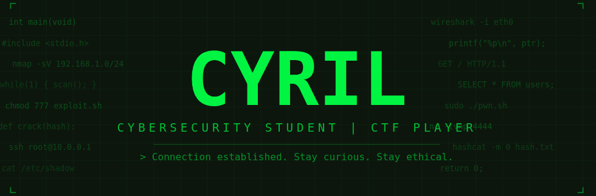

<div align="center">




</div>

---

## 👾 À propos de moi

```bash
┌──(cyril㉿kali)-[~]
└─$ cat whoami.txt

  Nom          : Cyril Iglesias
  Localisation : Pamiers, France 🇫🇷
  Statut       : Étudiant en Cybersécurité @ Holberton School
  Focus        : Sécurité offensive & défensive
  Objectif     : Devenir Pentester / Analyste SOC
  CTF          : TryHackMe | HackTheBox
```

---

## 💬 Motivation

> *Ce qui me passionne dans la cybersécurité, c'est de comprendre en profondeur comment les systèmes fonctionnent — leurs forces, leurs failles — pour mieux les défendre et protéger ceux qui en dépendent.*

---

## 🛠️ Stack & Outils

<div align="center">


</div>

---

## 🏴 CTF & Plateformes

<div align="center">

[](https://tryhackme.com)
[](https://hackthebox.com)

</div>

---

## 📌 Projets épinglés

### 🏠 [Holberton HBNB](https://github.com/Iglcyril/holbertonschool-hbnb)
> Clone d'AirBnB développé en Python — architecture MVC, API REST, stockage JSON/MySQL.  
> **Compétences :** Python · Flask · REST API · OOP · SQL

### 🐚 [Simple Shell](https://github.com/Iglcyril/holbertonschool-simple_shell)
> Implémentation d'un shell UNIX en C from scratch — gestion des processus, parsing, exécution de commandes.  
> **Compétences :** C · Unix · Processus · Mémoire · Système

---

## 🔗 Contact

<div align="center">

[](https://www.linkedin.com/in/cyril-iglesias/)

</div>

---

<div align="center">


`> Connection established. Stay curious. Stay ethical. 🔐`

</div>
